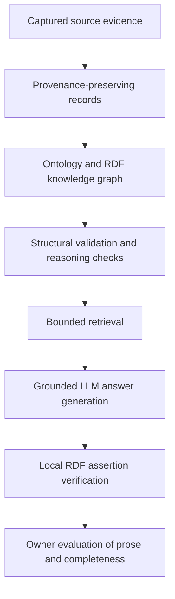

# Dementia Knowledge Graph + Grounded AI

A provenance-aware biomedical knowledge graph and retrieval-grounded AI evaluation project using bounded dementia evidence from Open Targets, Mondo and related captured source material.

## Why this project exists

This project tracks what sources record about Alzheimer disease and frontotemporal dementia: the disease concepts they use, links between records, and information they leave unresolved.

Original source values, mapping context, missingness and provenance remain available through RDF representation, retrieval and generated answers. Source assertions remain separate from biological or clinical conclusions.

## System workflow

Source captures, immutable record identities and release manifests support replay. SHACL checks structure; bounded OWL reasoning tests check semantic boundaries. Neither establishes biomedical truth. Generation returns text and structured assertions linked to supplied evidence; local verification checks those assertions separately from human assessment of the answer.

## Data and graph scope

The [accepted corpus manifest](manifests/dementia-development-001.json) pins **191 subject resources and 1,112 asserted triples** across five RDF files. This is a **qualified development corpus**, not comprehensive dementia coverage. Resources include provenance and source records, so this count is not a count of distinct biomedical entities.

The corpus includes:

- Eight Mondo concepts and five accepted parent assertions from a captured OLS slice declaring edition **2026-09-01**. Six additional raw parent rows remain outside the research projection.
- Eight historical **Open Targets 26.06** evidence occurrences: four Genomics England, two Europe PMC and two clinical-precedence records.
- Source-scoped disease references, disease–target evidence, mapping records, drug mechanisms, indications, study records, and provenance/selection context.

Historical PanelApp editions, some trial population/status context and datasource composition remain unresolved. Richer source intermediates are distinguished from the RDF available to retrieval. See the [corpus acceptance decision](docs/m2_closure_decision.md) and [graph characterisation](docs/m3_graph_characterisation.md).

## Knowledge representation

The [ontology](ontology/dementiagraph-v.ttl) declares **20 local classes, 27 local object properties plus external `prov:wasDerivedFrom`, and 39 datatype properties**. Its first implementation is declarations-only: no ontology imports, global domain/range axioms or added biomedical inference rules.

Associations, evidence occurrences, mappings and selection operations have explicit records. Original and normalized disease roles remain distinct; normalization does not assert equivalence. Drug mechanism, disease indication and study context are separate. Multiple records citing one report do not become independent confirmations.

The [conceptual contract](docs/m1_conceptual_model_contract.md), [ontology implementation](docs/m1_ontology_implementation.md) and [semantic acceptance record](docs/m1_semantic_acceptance.md) explain the design and its tests. Historical audit-derived fixtures are a separate test corpus, not live-source evidence.

## Retrieval and answering

[Retrieval](tools/development_retrieval.py) uses the same 48 RDF record packets for three offline methods: sparse TF-IDF lexical vectors, directed graph lookup with explicit anchors/filters, and reciprocal-rank hybrid fusion. These are bounded retrieval methods; the vector baseline does not use neural embeddings. Raw source-text blobs and non-RDF source computations are excluded equally.

The [M5 answering layer](docs/m5_verified_ai_preparation.md) supplies evidence and provenance to generation, supports qualified abstention, and checks structured assertions locally. The [retrieval contract](docs/m4_development_retrieval.md) documents budgets and method limits. Earlier development pairings and their [correction](docs/m5_retrieval_pairing_correction.md) remain recorded.

## M7 evaluation and findings

M7 is a **12-question development-overlapping portfolio challenge**, human-authored by the owner. It does not estimate unseen-question generalization. There were **24 generated responses**: 12 model-only and 12 KG-grounded. The verified condition reuses the grounded answer and evidence, applying local verification after generation.

Model-only intentionally had no project corpus access. Its inability to provide corpus-specific facts is not a retrieval failure. Grounded and verified prose are identical; assertion verification does not complete missing prose.

| Recorded outcome | Model-only | KG-grounded | Grounded + verification |
|---|---:|---:|---:|
| Completed outputs | 12/12 | 12/12 | Same 12 grounded outputs |
| Required-fact completion, question-level macro | 0% | 68.06% | 68.06% |
| Strict required facts conveyed | 0/21 | 14/21 | 14/21 |
| Retained structured assertions | 0 | 55 | 55 |
| Retained assertion support precision | Undefined | 100% | 100% |

The macro completion score averages question-level fractions; it is not the pooled 14/21 fraction. Assertion precision is conditional on the assertions submitted and retained. Verification-minus-grounded precision difference was **0**: there was no filtering effect in this run.

**Every retained grounded assertion could be supported by the supplied RDF while the answer could still omit other evidence required for a complete answer.**

Grounded answers used all required facts in M7-01, 02, 05, 06 and 09. Other answers omitted different details:

| Question | Incomplete evidence use |
|---|---|
| M7-03 | Cross-record / cross-relation integration |
| M7-04 | Citation and source details |
| M7-07 | Source context |
| M7-08 | Mechanism and indication details |
| M7-10 | Study and provenance details |
| M7-11 | Local scope and count context |
| M7-12 | Cross-record evidence chain |

The cause is unresolved: ranking, evidence selection, question interpretation, answer planning and generation were not isolated experimentally. These observations do not establish an ontology defect or a causal retrieval failure. Model-only M7-08, 10 and 12 introduced stronger external clinical/treatment scope leakage; other answers explicitly fenced background knowledge from corpus claims.

See [owner evaluation findings](docs/m7_owner_evaluation_findings.md) for scoring qualifications and question-level analysis, [machine-readable metrics](experiments/m7-portfolio-challenge-001/owner-review-metrics.json), and the [execution report](docs/m7_portfolio_results.md). Strict fact decisions came from the owner; finer annotations were assistant-entered under owner instructions. This is sole-owner-directed review, not independent review.

## Inspect the repository

| Start here | Purpose |
|---|---|
| [Project charter](docs/project_charter.md) | Research objectives and boundaries |
| [Ontology](ontology/dementiagraph-v.ttl) / [validation shapes](validation/m1_shapes.ttl) | Vocabulary and structural constraints |
| [Graph artifacts](kg/) / [release manifests](manifests/) | Asserted records, provenance and integrity pins |
| [Retrieval implementation](tools/development_retrieval.py) | Shared packet population and retrieval methods |
| [Frozen M7 package](evaluations/m7-portfolio-challenge-001/) | Questions, protocol and retrieval scopes |
| [M7 evidence and review](experiments/m7-portfolio-challenge-001/) | Preserved requests, outputs, verification and scoring |
| [Tests](tests/) / [reproducibility guide](docs/reproducibility.md) | Offline checks, environment and replay limits |

## Reproducibility

Start with the [offline inspection commands](docs/reproducibility.md): verify the corpus manifest, inspect retrieval, replay recorded execution and recalculate owner-directed metrics. These require no model calls. Raw source bodies are outside Git; complete source replay requires the corresponding local artifacts. Historical checkpoint documents remain unchanged and may describe an earlier status. There is no claimed one-command fresh-clone reproduction of acquisition or paid generation.

## Limitations

- This deliberately bounded corpus does not establish complete historical evidence coverage.
- The challenge overlaps rehearsed development capabilities. Sole-owner review provides no independent validation or inter-rater agreement.
- RDF support is not clinical correctness, treatment guidance or biological causality. Source phase/stage does not establish trial success; mechanism does not establish efficacy; an evidence occurrence does not establish causation; a source `APPROVAL` label is not independently revalidated regulatory status.
- Results do not establish unseen generalization, statistical superiority or universal advantage of grounding. Broader biomedical and independent evaluation remain future work.

## Status

Core implementation and M7 are complete for the current bounded portfolio challenge. M8 covers presentation and local release packaging. M6 agentic orchestration was not added without a demonstrated need. Broader validation and extension remain open; the wider research project is not complete.
